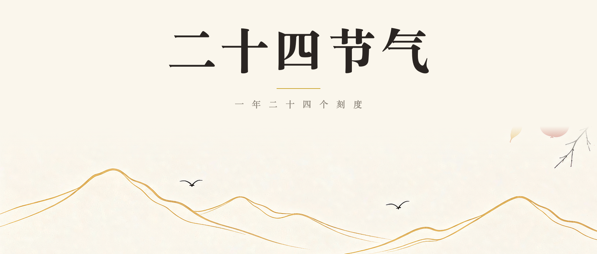
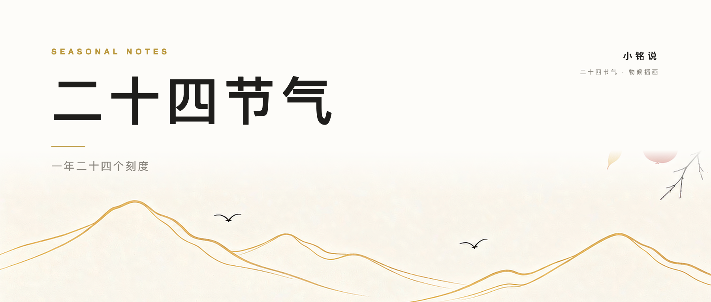
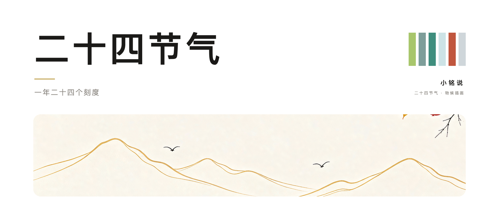
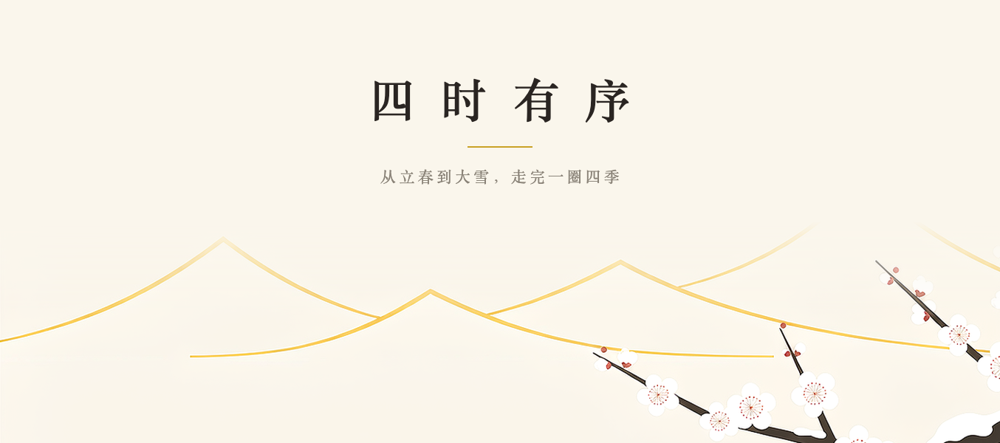
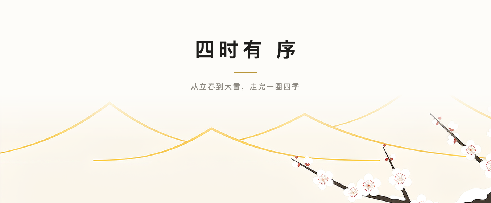
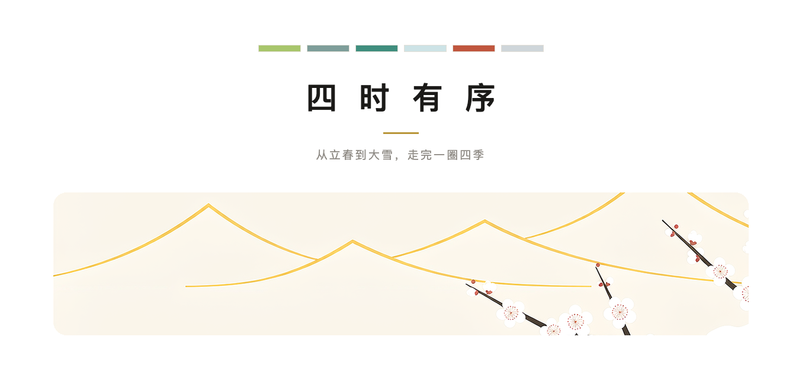

# 二十四节气 · 三套公众号排版模板

用同一套素材（新中式扁平插画 · 六张物候图）做出**三种版式**，同一篇正文各渲染一遍，
横向比得出差别。三套都以「时间」为主线：立春 → 清明 → 夏至 → 白露 → 霜降 → 大雪。

每套都齐**三件套**：**头图（1800×766，2.35:1）+ 章节分隔图 + 结尾图**。
正文 HTML 里图片全部 base64 内嵌，**全选复制即可粘进公众号编辑器，不会丢图**。

<p align="center">
  
  
  
</p>
<p align="center">
  <sub>节气卷 · 宣纸暖白 + 宋体 + 整幅段带</sub>　　<sub>留白笺 · 近白 + 无衬线 + 左对齐</sub>　　<sub>六色四季 · 纯白 + 圆角图卡 + 六色进度</sub>
</p>

---

## 三套的差别

|  | **节气卷** `01-节气卷/` | **留白笺** `02-留白笺/` | **六色四季** `03-六色四季/` |
|---|---|---|---|
| 底 | 宣纸暖白 `#FAF6EC` | 近白 `#FDFCF9` | 纯白 `#FFFFFF` |
| 字体 | 宋体（Songti SC / 思源宋体） | 无衬线（苹方 / 思源黑体） | 无衬线 |
| 对齐 | 章头居中 | **一律左对齐** | 章头居中 |
| 分隔图 | 1260×580 整幅段带 | 1400×189 窄带（左右渐隐成云带） | 1400×644 圆角图卡 |
| 时间怎么表达 | 六张段带逐章推进，图本身就是刻度 | 每章 `01 / 06` 序号 + 公历日期 | **六色色点排成进度条**，当前节气实心 |
| 层级靠什么 | 金线 `#C9A227` + 字号 | 留白 + 字号 | 四季色 + 字号 |
| 适合的选题 | 文化、节气、慢读类长文 | 观点、清单、信息密度高的稿 | 数据、对比、节奏感强的稿 |

<p align="center">
  
  
  
</p>

三套的正文、章节、色板都从 `_lib/copy.py` 读，**改一处三套同步**。

## 先看效果

- 三套对照总览：打开 `预览.html`（整页缩略图 + 头图 + 结尾图 + 规格摆在一起）
- 单套样板（已内嵌图片，可离线看）：
  [`01-节气卷/成稿-可复制.html`](01-节气卷/成稿-可复制.html) ·
  [`02-留白笺/成稿-可复制.html`](02-留白笺/成稿-可复制.html) ·
  [`03-六色四季/成稿-可复制.html`](03-六色四季/成稿-可复制.html)

> GitHub 上想直观看整篇节奏，点开 [`预览/`](预览/) 里的 `*-整页.png`。

---

## 怎么用

**直接用**：浏览器打开某套的 `成稿-可复制.html` → `⌘A` 全选 → `⌘C` → 粘进公众号编辑器。
图片是 base64 内嵌的，粘过去不会丢图。

**换内容**：改 `_lib/copy.py`（标题、开场、六章、收束、落点动作），再重跑该套的 `build_article.py`。

**换规格**：改该套 `build_article.py` 顶部的常量（`PAPER` / `INK` / `GOLD` / `P` / 字号）。

**换节气或换图**：改 `_lib/jqimg.py` 里的 `SERIES`（**顺序即时间顺序**），把新图放进 `素材/`。

```bash
# 每套目录内
python3 gen_images.py               # 从 素材/ 裁出该套要用的图 → 图/
python3 build_article.py            # 成稿-可复制.html（base64 自包含）
python3 build_article.py --plain    # 成稿-可读.html（相对路径，便于核对）

# 仓库根目录
bash render.sh 01-节气卷             # 生成头图 / 结尾图（无头 Chrome 截图）
bash shot.sh   01-节气卷             # 量真实页高 → 整页截图 → 切片 + 缩略图
python3 make_preview.py             # 重出 预览.html 与缩略图
```

依赖：Python 3 + Pillow，本机装了 Chrome 即可（截图脚本自己处理沙箱参数）。
若 `python3` 不是装了 Pillow 的那个，两个 shell 脚本都支持覆盖：

```bash
PY=/path/to/python3 bash render.sh 01-节气卷
```

---

## 目录

```
_lib/
  jqimg.py          取图工具：金线锚点、裁带、渐隐、抽主色、切圆角
  copy.py           三套共用的演示正文（改内容只动这里）
素材/               六张原插画（1260×840）+ 系列总览
render.sh           通用出图：gen_html.py → 无头 Chrome 截头图 / 结尾图
shot.sh             通用核对：量页高 → 整页截图 → 切片
make_preview.py     生成 预览.html + 缩略图
预览/               对照页用的缩略图
01-节气卷/  02-留白笺/  03-六色四季/
  gen_images.py     从素材裁该套要用的图 → 图/
  gen_html.py       生成头图 / 结尾图 HTML + _build/shots.tsv
  build_article.py  生成正文 HTML（可复制 / 可读两版）
  图/               裁好的图 + 渲染出的头图、结尾图
  成稿-可复制.html    最终交付物（base64 自包含，直粘公众号）
  成稿-可读.html      核对用（相对路径引图）
```

---

## 取图时踩过的坑（都写在代码注释里了）

**金线锚点不能用「第一处出现金色」的位置。** 六张图的山脊线是 `#C9A227` 的金色曲线，
但霜降那张的柿子叶也是金黄色、大雪那张有杂点 —— 按「第一处金色」定位，锚点会被叶子
骗到 y=360 而真山脊在 478，裁出来的带里只剩天空。`jqimg.gold_axis()` 改成
「逐行数金色像素取 argmax」：山脊是横贯画面的长线，峰值行一定落在它身上。

**渐隐的像素数必须小于「金线之上留出的天空」。** 否则渐隐会把金线本身也吃掉，
裁出来的带子上什么都没有（套二的头图就这样空白过一版）。

**裁切的底边一律切在图片下沿。** 半路截断会在山体中间留一条硬边；顶边则叠一段
alpha 渐隐（90–140px），把垂下来的柳枝、飞鸟、云气的断口化掉。

**别按图逐张调参。** 六张插画共用同一套版式网格，段带用统一的 `y=260→840`
反而让六章节奏一致；只有窄带、图卡这类要贴着主体走的才用锚点。

**图卡圆角烧进 PNG，不靠 CSS。** 粘进公众号之后 `border-radius` 能不能活下来由编辑器决定；
`jqimg.round_corners()` 直接把四角填成底纸色，这样一定在。

**内嵌图必须压过再进 HTML。** 六张 1260 宽的 PNG 直接内嵌会做出 7MB 的 HTML，粘进编辑器
非常卡。按显示宽度（677px）两倍缩放 + JPEG q86 progressive，肉眼无差，体积降到约 1/8。

**Python 拼 CSS 的 `%` 陷阱。** 参与 `%` 格式化的字符串写 `%%`，不参与的写 `%`；写错任一边，
轻则整条声明变成非法值被静默丢弃，重则直接 `ValueError: unsupported format character`。
**中文全角括号紧跟 `%`（如「62%（」）最容易中招。**

**`font-family` 一律用单引号。** 用双引号会提前截断 `style="..."` 属性，后面的声明全部静默消失。

**量页面高度再截图。** 高度由内容行数决定，写死的窗口高度不是漏底就是截掉最后一行；
量高和截图还必须同宽（宽度决定换行，进而决定高度）。

**截图前把 `图/` 一起拷到临时目录。** 页面放到 `/tmp` 子目录后，正文里的相对路径图片会全 404，
截图里只剩 alt 文字，很容易误判成「图渲染错了」。

---

## 素材与配色

插画为新中式扁平插画系列（六张 1260×840 + 一张总览），见 [`素材/`](素材/)。
配色规范取自该系列：宣纸底 `#FAF6EC`、金线 `#C9A227`、主墨 `#2A2522`；
四季色板 —— 嫩绿 `#A8C66C` / 烟青 `#7E9E9A` / 碧荷 `#3F8E7E` /
月白 `#CDE3E6` / 丹红 `#C0563E` / 雪白 `#F2F4F5`。

`月白` 和 `雪白` 是**面颜色**，直接当文字色在白底上看不见 —— 三套里的文字色都用了
同色系压暗一档的值（见 `copy.py` 每章第 7 个字段 `文字色`），色点 / 色条展示时
雪白换成雪灰 `#CFD6DA`。

对外发布前请自行确认插画的使用授权。
